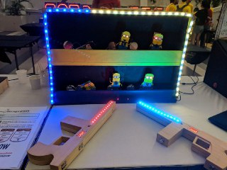
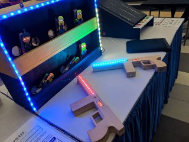
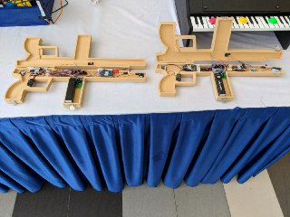
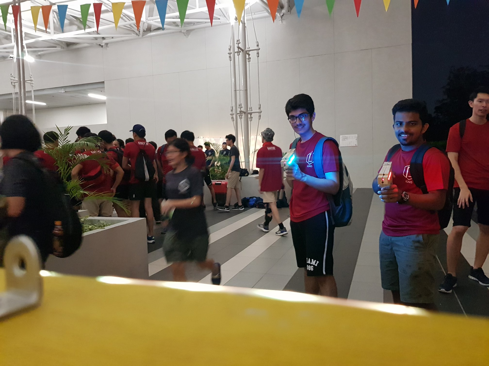
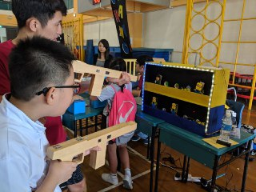
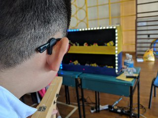
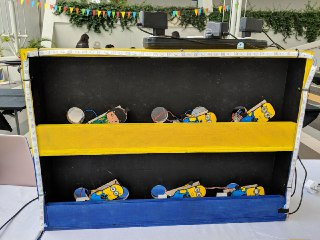
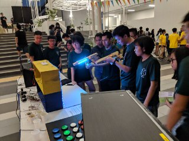

# MinionsArcade

## About
This shooting gallery arcade game is controlled by the Arduino micro-controller. Each moving part is moved using a servo motor. Each target has an Infra-red sensor to detect if it has been hit, and score is also kept, allowing competitive play. 

The structured is 3D modelled and sent to a vendor to be built from wood. There are 2 guns where we can use to aim at the moving targets. Pulling the trigger will send an Infra-red signal that will be scored if it hits the target’s sensor accurately. A laser diode is mounted on the gun for aiming as well. 

The gun consists of 2 arduino nano:  
* Minions_Gun_Arduino_Laser code for the nano connected to the 2 switches, laser, and neopixel  
* Minions_Gun_Arduino_Score code for the nano connected to the IR receiver, sevseg, and vibration module  

The nano mounted on the target board will use the Minions_Slave_Arduino code  
The mega will use the Minions_Master_Arduino code  

## Technology
Upon pressing the trigger button, the gun will send an infra-red signal through the laser diode. If it hits the target's sensor accurately, it will register a hit and the target will move down. The timer countdown of 60 seconds in a match is shown visually through the LED strip.

## Outreach
The game has been displayed around campus in Nanyang Technological University, as well as in Temasek Primary School, where the primary role is to inspire people to pursue their dreams and get into engineering fields. 

## Image Gallery

